# SkillUp Coach 🎓

**A Telegram bot that helps IT professionals build skills — one small step at a time, without burnout.**

> Bot: [@SkillUpCoachBot](https://t.me/SkillUpCoachBot) · Product doc: [docs/PRODUCT.md](docs/PRODUCT.md)

---

## 🎓 Что это такое

**SkillUp Coach** — телеграм-бот-коуч для IT-специалистов. Помогает прокачивать навыки **без перегруза и выгорания**: каждый день — один маленький шаг (теория, практика или общение). Бот ведёт серию, считает звёзды и поддерживает, когда мотивация уходит.

Вместо «ещё одного трекера привычек» — **структурированный путь**: выбор цели → подбор навыков → ежедневный цикл → аналитика прогресса.

---

## 📸 Демо

### 🚀 Онбординг

| Приветствие | Выбор цели | Выбор навыков |
|---|---|---|
| 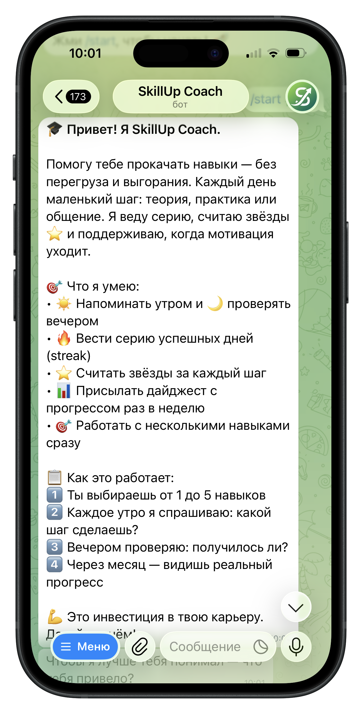 | 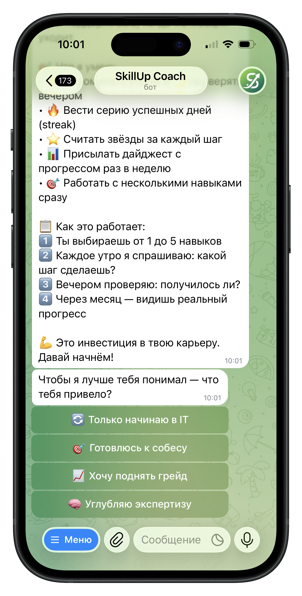 | 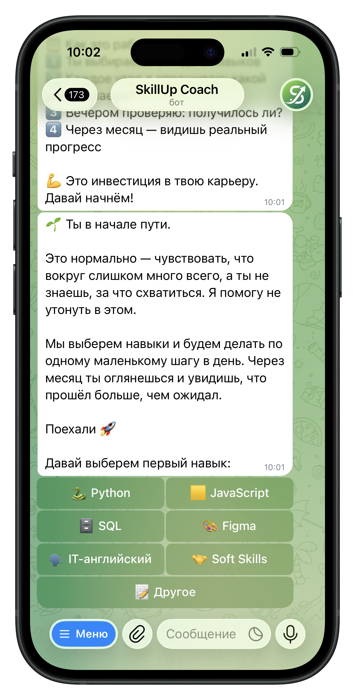 |

| Добавление навыка | План на день |
|---|---|
| 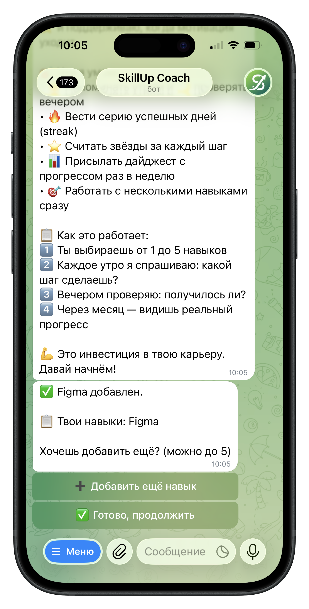 | 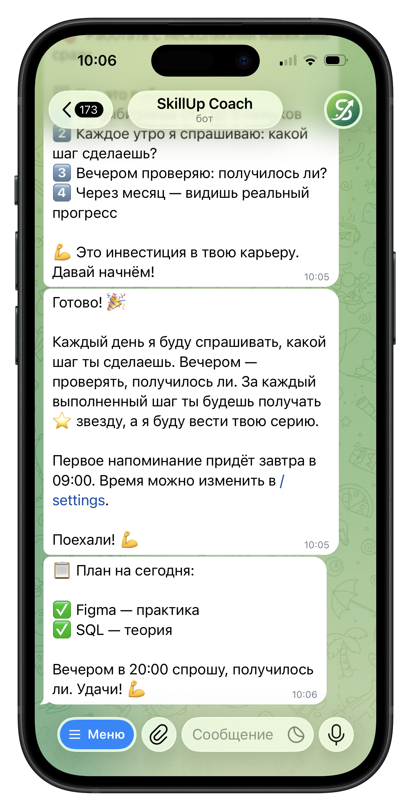 |

### 🔄 Ежедневный цикл

| Утренний вопрос | Вечерний чекап |
|---|---|
| 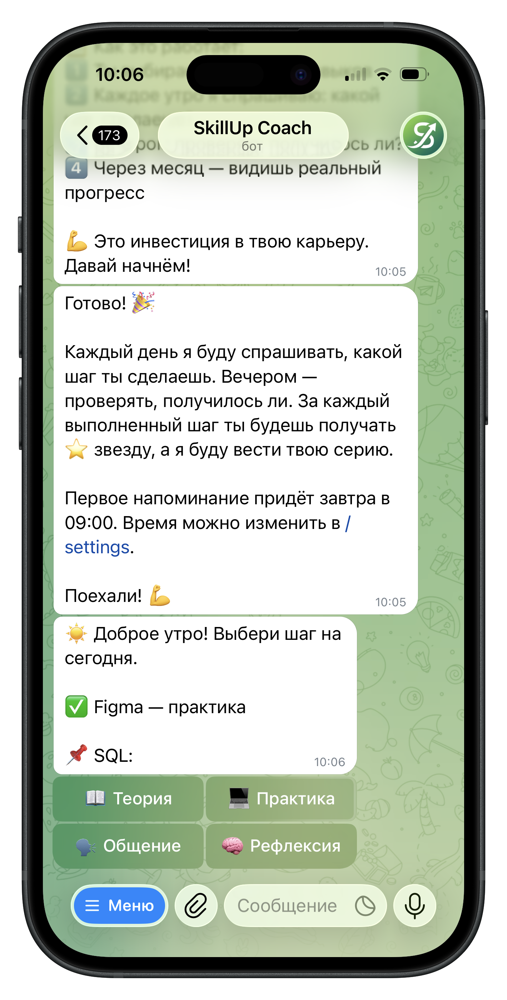 | *Скрин появится вечером* |

### ✨ Нативные фишки и поддержка

| Меню команд | Справка `/help` | Обратная связь |
|---|---|---|
| 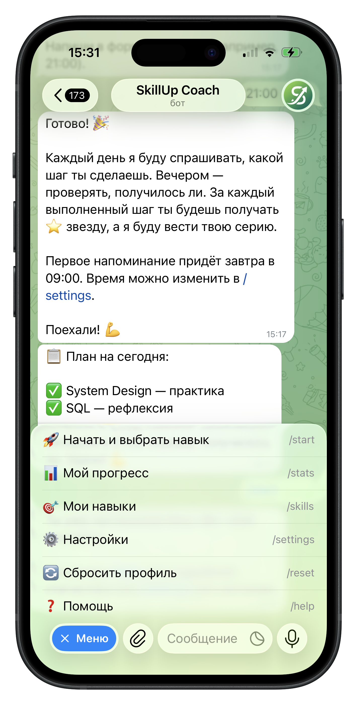 | 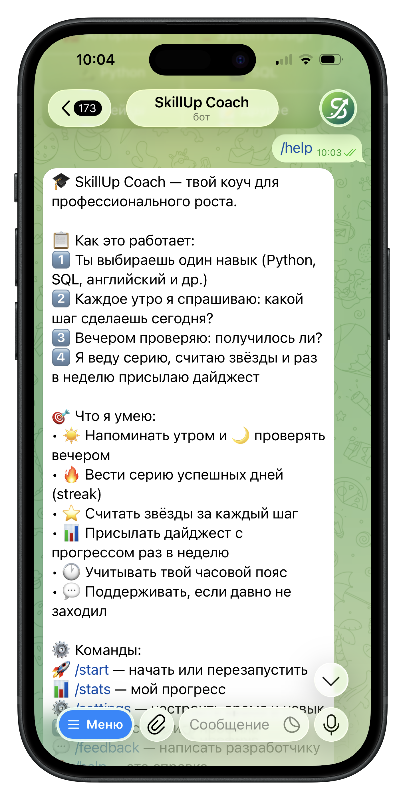 | 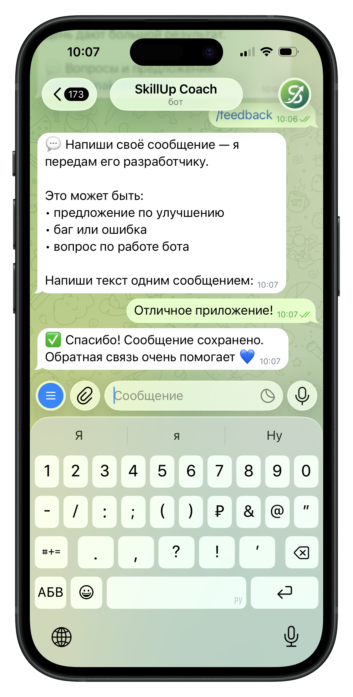 |

| Сброс профиля | Бот помнит пользователя |
|---|---|
| 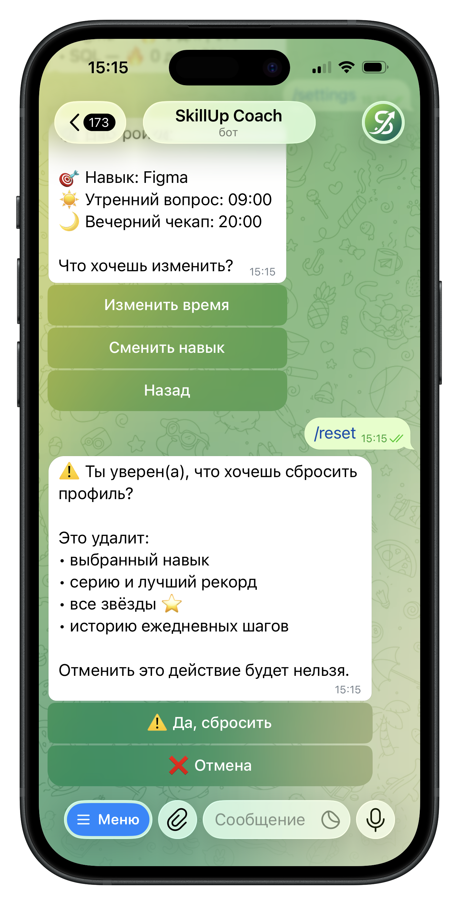 | 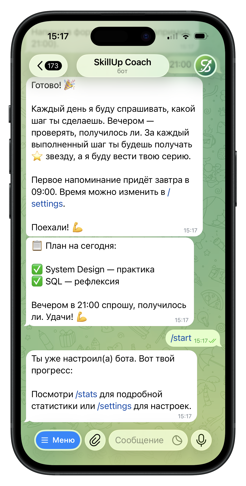 |

## ✨ Что умеет

- 🎯 **Онбординг под цель** — 4 сегмента (новичок / к собесу / грейд / экспертиза) с разными наборами навыков.
- 📚 **До 5 навыков одновременно** — можно комбинировать Python, SQL, английский и др.
- ☀️ **Утренний вопрос** — «Какой шаг сделаешь сегодня?» (теория / практика / общение / рефлексия).
- 🌙 **Вечерний чекап** — «Получилось?» (✅ / ❌ / ⏳).
- 🔥 **Серия дней (streak)** — ведёт ритм, мотивирует не бросать.
- ⭐ **Звёзды за каждый шаг** — осязаемый прогресс.
- 📊 **Статистика `/stats`** — метрики, календарь активности, разбивка по навыкам.
- 📬 **Еженедельный дайджест** — итоги недели + совет (по воскресеньям в 18:00).
- 💬 **Nudge-сообщения** — если пользователь не заходил 2+ дня, бот напомнит с поддержкой.
- 🌍 **Часовые пояса** — напоминания приходят в удобное время.
- 📮 **Обратная связь** — `/feedback` пишет разработчику.
- 🛠 **Админ-панель** — `/admin_stats` и `/admin_feedback` для метрик.

---

## 🛠 Стек технологий

| Слой | Технология |
|---|---|
| Язык | Python 3.11 |
| Telegram | aiogram 3.x |
| БД | SQLite + WAL |
| Планировщик | APScheduler |
| Хостинг | Railway + Volume (persistent storage) |
| Деплой | Railway CLI |

---

## 🚀 Запустить локально

```bash
git clone https://github.com/EkaterinaK-2026/SkillUpCoachBot2.git
cd SkillUpCoachBot2
python -m venv venv && venv\Scripts\activate
pip install -r requirements.txt
```

Создай файл `.env` в корне с токеном от [@BotFather](https://t.me/BotFather):

```env
BOT_TOKEN=your_telegram_bot_token
```

Затем запусти:

```bash
python main.py
```

Бот начнёт polling — открой [@SkillUpCoachBot](https://t.me/SkillUpCoachBot) и напиши `/start`.

## 📂 Структура проекта

```
habit_coach_bot/
├── handlers/           # Обработчики команд
│   ├── start.py        # /start и онбординг
│   ├── daily.py        # Утренний/вечерний цикл
│   ├── commands.py     # /stats, /settings, /help, /feedback
│   └── digest.py       # /digest
├── docs/               # Документация и скриншоты
│   ├── PRODUCT.md      # Продуктовое описание
│   └── *.png           # Скриншоты бота
├── core.py             # Работа с БД
├── keyboards.py        # Inline-клавиатуры
├── texts.py            # Все тексты бота
├── scheduler.py        # Планировщик (утро/вечер/дайджест/nudge)
├── main.py             # Точка входа
└── requirements.txt
```

---

## 📊 Метрики продукта

Бот отслеживает ключевые продуктовые метрики через `/admin_stats`:

- **Activation Rate** — % прошедших онбординг до конца.
- **Retention D7 / D30** — % возвращающихся через неделю / месяц.
- **Средняя длина серии** — индикатор вовлечённости.
- **Распределение по целям** — какие сегменты популярны.
- **Топ навыков** — что чаще всего выбирают.

Подробнее о продуктовой логике — в [docs/PRODUCT.md](docs/PRODUCT.md).

---

## 🗺 Roadmap

### ✅ v1.0 — MVP (готово)
- Онбординг с 4 сегментами
- Мульти-навыки (до 5)
- Утренний / вечерний цикл
- Серия, звёзды, статистика
- Дайджест, nudge-сообщения
- Часовые пояса, обратная связь
- Админ-панель с метриками

### 🚧 v1.1 — Углубление
- PostgreSQL вместо SQLite
- Веб-дашборд с графиками
- Экспорт данных в CSV

### 🎯 v2.0 — Монетизация и B2B
- Freemium-модель
- Корпоративные челленджи для HR
- Premium-программы по навыкам
- Партнёрства с онлайн-школами

Подробнее — в [docs/PRODUCT.md → Roadmap](docs/PRODUCT.md#-roadmap).

---

## 👤 Автор

**Екатерина Кравченко** — продакт-менеджер и разработчик.

- Telegram: [@ekaterinakravchenko](https://t.me/ekaterinakravchenko)
- GitHub: [@EkaterinaK-2026](https://github.com/EkaterinaK-2026)
- Бот: [@SkillUpCoachBot](https://t.me/SkillUpCoachBot)

Пет-проект создан как демонстрация продуктового мышления и навыков разработки Telegram-ботов.

---

## 📄 Лицензия

MIT — используй, форкай, улучшай.

---

*Последнее обновление: сентябрь 2026*